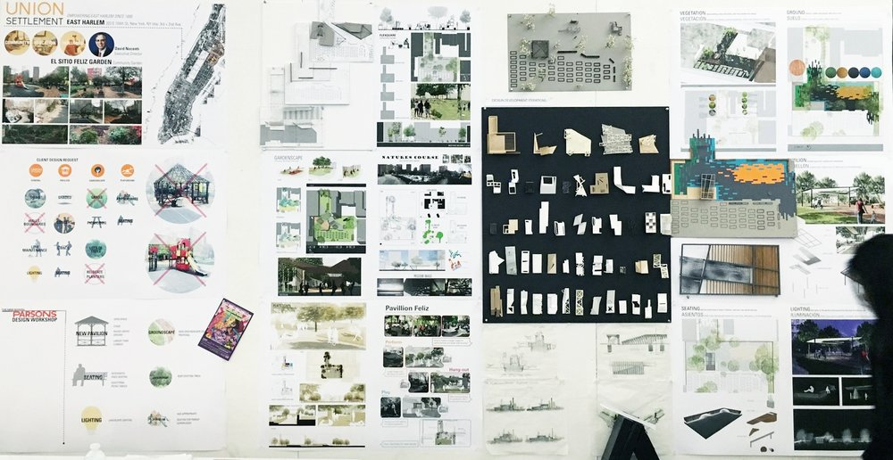

# Professional Development - 
## Beyond the transcript...

Put yourself in a recruiters shoes - you have a stack of resumes and everyone has good grades, the right classes, and a snazy resume. What do you do? Throw the 100 resumes you get per 20 schools you visited on a stack? How do you pick which students to screen, which to interview?

A good way to differentiate  you from the stack is to have the resume in order - but also have a website, blog, and possibly a demo reel / videos to enhance your image. These extra items showcase your technical abilities but also gives the viewer insight into who you are as a person – how you present yourself, what your interests are, and a dose of your personality. This allows people to see how you think - how you attacked the problem. And if you will be a 'culture' fit too.

**A few generalities:**
- Use Images and infographics wherever  you can - they say 1000 words (so you don't have to).
- Breaks are a great time to focus and work on these 5 areas.
- Separate  "design" from "content" so you can change either without affect the other
- Keep a flexible  directory of videos, images, materials so you can craft specific items to the position you target - don't lock into one of everything.
- Don't pad with filler (shorter is better).
- Best first. (screw chronological order whenever  you can)

**Here we will cover 5 Parts explain each and provide examples:**
1. Resume
2. Side Projects
3. Website
3. Blog
4. (Demo Reel) / videos

### Resume
---
You need a resume. Even as a 21st century job candidate  you still need a resume even if it is archaic and people really only glance at it for a few minutes. You have to make sure it is in order and conveys the proper information. Look at some good examples and see what information they are trying to get across, and personalize it with yours.

- Learn the difference between a CV (Curriculum Vitae) and resume.
- Resumes show be 1 page
- Don't use size 7 font
- Technical  and best work first
- You don't have to list every little thing.
- Get it critiqued by your peers and mentors

Your resume should include: Education, Work Experience, Skills, Personal Projects, Relevant Activities/ Awards, etc. Do not post your phone number or address on a public resume (especially if you are female- we have witnesses cases of stalking, list your website and email contact). Have a version you can email to recruiters - but even then - Google Voice number... Your resume should be clean and fit on a page. Cut references if you need to. Don't cram every little detail. Have a longer CV style one as you get older and more accomplished.

** Examples ** of my past /current students (for inspiration):
- [Isabela Rovira](resume-isabela.pdf)
- [Nathan Marshak](resume-nathan.pdf) 
- [Dan Knowlton](resume-dan.pdf)
- [Kaitlin Pollock](resume-Kaitlin.pdf)
- [Matthew Croop](resume-croop.pdf)
- [Samantha Raja](resume-samantha.pdf)

### Side Projects
---
This is arguably  ** the most important part **. People want to see you extending and applying your knowledge from the classroom. A 4.0 GPA is worthless without outside experience and projects. You get this experience two ways: first is sponsored work from internships, research work, and job work. Second is extending class projects into something deeper, pushing them further and working on side coding, hardware, and art projects. The best students I have mentored have been judged almost exclusively on their side research and project work. Everything else is just a way to show off this cool work.

- Start small, do it often
- Plan first, attack and adjust
- Create a Github account
- Ask mentors for project ideas

**Starting a Project: ** Projects start with ideas and inspiration. Architects have a great way to express this as they start off (and as they conduct a project). They use a "pin up" wall to express the "narrative" of what they are trying to accomplish, why they are doing it, and how they will attack it. You should start to gather and organize your inspiration - both to pitch your idea and to organize a plan of attack for yourself. This is useful if its a random directory, OneNote sheet, or something to organize code or visuals why you are doing what you are doing. This also helps you figure out what to work on... 

If you are really stuck, I ask students to make a list of 5 things they like (with images) and 5 things they do not like (with images) to help paint a starting picture in rough strokes.

**Types of Project (Class work): ** An easy way to get some good work is to extend a project you have already completed in class. For example: Karl worked on the [** Jello Cube project **](http://www.yiningkarlli.com/projects/jello.html) here in class, and extended it to have multiple cubes, a fancy scene, and nice render. But you can google "CIS563 Jello" and see many others have extended this (and the smoke simulation) into great original work.

**Types of Project (Personal Projects): ** Personal projects come in two flavors - short term, flashy, proof of concept projects, and long term deeper projects that take years (and really never truly  finish). Short term projects include things like: mocking up [examples in D3.js](https://github.com/d3/d3/wiki/Gallery), making [Jupyter notebooks](https://github.com/Rohan0401/House-Price-Prediction-Analysis/blob/master/HousePricePrediction.ipynb) and [another example](https://github.com/Rohan0401/Time_series_using_RNN/blob/master/Final%20Project.ipynb).

Then you have the longer term projects that last longer and dive deeper. Peter Kutz has been working on his renderer ([** Photorealizer **](http://photorealizer.com/)) for multiple years. Karl has been as well and [** blogs about the details **](http://www.yiningkarlli.com/projects/takuarender.html). Lars has some really [ **great hardware projects **](http://www.larsi.org/projects/). Dan has been working on his fluid simulator for at least 3 iterations. But this work takes an interesting  problem and really dives deep into creating a coding framework, visuals, and other important features. 

**Types of Project (Research Work): ** This is where you usually dive in the deepest. Working on something for one, two, three... semesters. Something you can dive in deep and hopefully one day publish, patent, or exhibit. This is usually done with a mentor, research lab, and team. It can be at school or on an internship. This is really the strongest side project since you also get a strong recommendation, mentor, and lab mates to go along with it.
- [Motion Databases](https://dl.acm.org/citation.cfm?id=2448199) - Tiju, Igor
- [Fruit Decay](Fruit Senescence and Decay Simulation) - Samantha
- [Exhaustion](https://dl.acm.org/citation.cfm?id=2019423) - Kaitlin
- [Sky Rendering](https://dl.acm.org/citation.cfm?id=2661259) - Karl, Dan, Jeremy
- ....

### Website
---
Website (and social media) collect and disseminate all your work, blog, videos, images, etc in one clean spot. Something you can quickly link people too, something people can find when they google you (or the topic you are diving deep into above!).

** A note on social media. ** Use it. But use it professionally. Separate out, as early as you can, you professional self from your personal self. (Keep a personal facebook (or use groups properly), have a personal instagram and snapchat) .. don't mix the two. Recruiters, future employers  all will comb your social media profiles ... don't let friends randomly tag you doing bad things...)

Use social media to advertise your cool stuff (See [** Patrick's twitter feed **](https://twitter.com/pjcozzi)). Nothing beats people seeing your work on instagram, twitter and facebook. (Use tools to cross post properly.)

** Linkedin **-  Get a linkedin page, keep it updated. It is an important professional front to your work as well and some people expect it.

#### How to creat a website
There are really two ways to create a website these days: Use a content management system (wordpress, jekyll, etc) or roll your own HTML/php code and design. (Don't use sites like wix, etc... they lock you in). - Try to seperate your content from your design so you can update both. But start simple - draw (or photoshop) your design -start from the top with your Name, menu -then add content and subpages. Learn to use the "inspect" aspect of Chrome, and "view source" to see how other people have done it. Use [** CodePen **](https://codepen.io/) or something similar to test things out... but even if you just google "bootstrap menus" or "wordpress free templates" you get many hits.

- ** Register a domain name ** - usually your name.com

- ** Bootstrap ** - Likely people will view your page on a mobile device or super awesome hardware (think about our setups...) - so your website should be "responsive" and look great on mobile and desktop. A few years ago, Twitter pioneered this concept with [Bootstrap](https://getbootstrap.com/)- there are variants- Pure, Material, Simple Grid, ink, etc... but something that is responsive is good.

- ** Hosting yourself(ish) ** - people test out their websites locally using [** WAMP **](http://www.wampserver.com/en/) or LAMP or local server .. and install [** Wordpress in 5 minutes **](https://codex.wordpress.org/Installing_WordPress#Famous_5-Minute_Installation). Then copy the files to a cheap host like Bluehost, Hostmonster, hostgator. There are a lot of free Wordpress design templates. Start with one and drift off. If you are handy (or want to be) it is not terribly hard to modify or build a wordpress template. - Mobile first.

- ** Hosting via Github ** - when you register your github account (and you pick a smart name) you get yourRepoName..github.io for [ **free when you create that repository **](https://pages.github.com/). I know many people that just have their domain name redirect there. It uses Jekyll under the hood. Its a stable cheep way to do it (and get a cheap https name.)

- ** Blah ** - I don't love the wix, weeblys of the world since they create a boilerplate website and lock you into specifics. Usually people only keep them for a few months then change it out with Custom HTML/PHP/CSS/JavaScript in a few months. I would avoid them. But no one really listens.

** Examples ** of my past /current students (for inspiration):
[Isabela Rovira](https://www.irovira.com/) - in progress site.
[John Sermarini](https://johnsermarini.com/) - John just made his over the summer!
[Karl Li](http://www.yiningkarlli.com) - current Cornell Master's student
[Dan Knowlton](https://danknowlton.com/)
[Lars Schumann](http://www.larsi.org) - (my colleague, not student) - more hardware focused
[Jeremy Newlin](http://projects.jeremynewlin.info/)
[Peter Kutz](http://www.peterkutz.com/) - everyone drools over this.
[Marrisa Krupen](http://marissakrupen.com/)

** Examples ** of not my students, but great examples (for inspiration):

[Rohan Singh Rajput](https://rohan0401.github.io)
[IQ](http://iquilezles.org/index.html) - you would too if they were your intials :)
[Benedik Bitterli](https://benedikt-bitterli.me/ ) - nice clean site

### Blog
---
Your blog is where you post more information about how you created things. It lets people see your "depth" of understanding about the topic. As you program and as you work - save images, take videos, document it as you go along. (* FUTURE YOU will thank you). My mentor Kevin always said do it right first, since when you need it you will be under a time crunch. - that basically means if you have a well curated  blog, website, collection of movies - you have all the material to show someone when it matters. .. there is not last minute rush...

(The new trend is to integrate ("in the browser") demonstrations - be it d3.js, webGl, webCL, Python Juypter notebooks, Trinkets - this is where things are going - look into this for your posts to stay ahead of the curve.)

Let's look at a few posts from Karl that start simple and scale in complexity over a few years... (there are many in between here)
- [First Path traced Image](http://blog.yiningkarlli.com/2012/03/first-pathtraced-image.html)
- [Sampling Surfaces](http://blog.yiningkarlli.com/2012/07/random-point-sampling-on-surfaces.html)
- [Mulitple Importance Sampling](http://blog.yiningkarlli.com/2015/02/multiple-importance-sampling.html)

We went from very basic stuff to very very complex equations and depth of understanding. The posts are clean and explain what is happening. We give a nod to history with the Cornell Box ... and the Veach Importance Sampling scenes to show we really understand CG history and importance. There are detailed equations that show depth on topics.

Peter might not have the best blog design - but his content is out of this world amazing for his [** Photorealizer blog **](http://photorealizer.blogspot.com/) - definitely  check this out. It shows a real deep dive into a topic, but each post is self contained for a specific problem.

[** Jeremy's blog **](http://blog.jeremynewlin.info/) is a little more high level about a few of his projects.

[** John's page **](https://johnsermarini.com/) is essentially his blog, and he has some good posts from his work over the summer.

### (Demo Reel) / Videos
---
We live in a world with Youtube. So there are two aspects here - you make short videos to highlight what you worked on [(see **Jeremy's** page)](https://vimeo.com/jeremynewlin) and [** Karl's page **](https://vimeo.com/user3522674) for a good example of short project based videos. Demo reels are good if you are looking for a creative position (they are not essential for every job).  - generally a demo real is just a collection of your best work - so if you keep and document videos as you go along, it should be easy to throw one together. You also need a [ ** shot breakdown **](https://danknowlton.com/documents/danknowlton-reelBreakdown.pdf).

** Examples ** of my past /current students (for inspiration):
[Karl Li current one](http://yiningkarlli.com/demoreel.html) ... here is [an older version](https://vimeo.com/20909195) and [an even older version](https://vimeo.com/20205051)
[Isabela Rovira](https://www.irovira.com/projects/5804834) - in progress site.
[Dan Knowlton](https://danknowlton.com/)
[Jeremy Newlin](https://vimeo.com/82315712)
[Kaitlin Pollock](https://vimeo.com/29504461)
[Marissa Krupen 2016](https://vimeo.com/154743081) and [her 2012 reel](https://vimeo.com/51125974)

